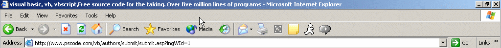



## Mouse Wrap

### Description

This application will make your mouse wrap around the screen. For example: move the mouse to the far right of the screen and the mouse will apear on the left side
 
### More Info
 
This code uses a timer that constantly look. Although it take virtually 0% of cpu usuage.. there has to be a way to hook the mouse and catch the cordinate messages.. if anyone has any ideas please let me know.

             |
---                |---
**Submitted On**   |2004-07-11 12:13:40
**By**             |[Sean M Siegel](https://github.com/Planet-Source-Code/PSCIndex/blob/master/ByAuthor/sean-m-siegel.md)
**Level**          |Intermediate
**User Rating**    |4.3 (13 globes from 3 users)
**Compatibility**  |VB 5\.0, VB 6\.0
**Category**       |[Miscellaneous](https://github.com/Planet-Source-Code/PSCIndex/blob/master/ByCategory/miscellaneous__1-1.md)
**World**          |[Visual Basic](https://github.com/Planet-Source-Code/PSCIndex/blob/master/ByWorld/visual-basic.md)
**Archive File**   |[Mouse\_Wrap1768387112004\.zip](https://github.com/Planet-Source-Code/sean-m-siegel-mouse-wrap__1-54868/archive/master.zip)

